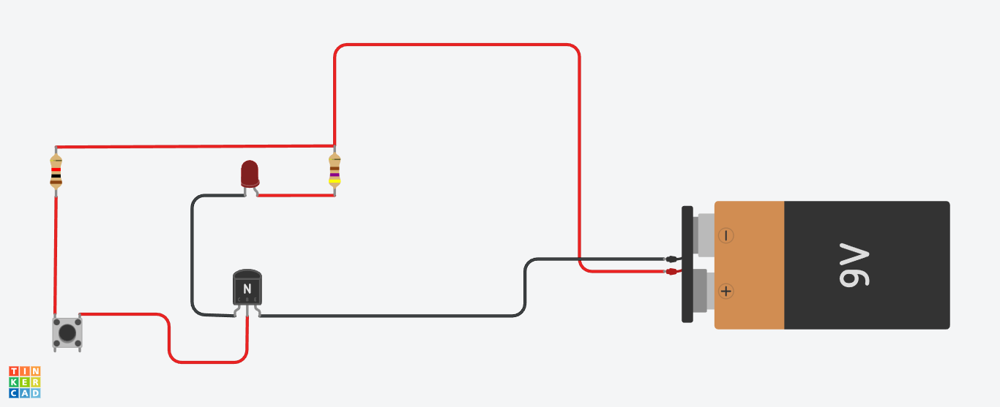

# Guía de Procedimientos: Implementación de Bit | Bit Implementation Procedure Guide

**Fecha | Date:** 19 de octubre de 2025  
**Versión | Version:** 1.1.1  
**Proyecto | Project:** 8-Bits Processor  

---

*[🇪🇸 Español](#-español) | [🇺🇸 English](#-english)*

---

## 🇪🇸 ESPAÑOL

## Procedimiento 1: Simulación en Tinkercad



**🔗 Simulación Interactiva:**
<div class="embed-simulation">
<iframe src="https://www.tinkercad.com/embed/57Rf0VVflk2-bit?editbtn=1" frameborder="0" marginwidth="0" marginheight="0" allowfullscreen></iframe>
</div>

### Materiales Necesarios
- 1x Transistor NPN (2N2222 o similar)
- 2x Resistencias (220Ω y 1kΩ)
- 1x LED
- 1x Batería (9V)
- Cables de conexión

### Pasos de Implementación

1. **Configuración del circuito base**
   - Conectar el emisor del transistor a tierra (GND)
   - Conectar el colector a través de resistencia de 220Ω al LED
   - Conectar el otro terminal del LED a VCC (9V)

2. **Configuración de control**
   - Conectar la base del transistor a través de resistencia de 1kΩ
   - Crear punto de entrada para señal de control

3. **Verificación de estados**
   - **Estado 0:** Señal de control = 0V → LED apagado
   - **Estado 1:** Señal de control = 9V → LED encendido

4. **Pruebas de funcionamiento**
   - Alternar señal de control entre 0V y 9V
   - Verificar respuesta del LED (ON/OFF)
   - Confirmar conmutación limpia sin estados intermedios

### Consideraciones Técnicas

**Cálculo de Corriente del LED:**
- Voltaje de alimentación: 9V
- Voltaje directo LED (típico): ~2V
- Resistencia limitadora: 220Ω
- Corriente: I = (9V - 2V) / 220Ω = 31.8mA

⚠️ **Nota importante:** La corriente calculada (31.8mA) excede ligeramente el límite recomendado de 20mA para LEDs estándar. Para mantener una corriente segura < 20mA, se recomienda usar una resistencia de 390Ω:
- I = (9V - 2V) / 390Ω = 17.9mA ✅

## Procedimiento 2: Abstracción en JavaScript

### Implementación Final (bit.js)

```javascript
export function bit(input = 0) {
    let bitValue = input;
    bitValue = bitValue ? 1 : 0;
    return bitValue;
}
```

### Implementación de Prueba (transistor.js)

```javascript
import { bit } from "./bit/bit.js";

function main() {
  console.log("El transistor envía señales alternadas al bit:\n");
  
  for (let i = 0; i < 10; i++) {
    const signal = i % 2;     // Genera señal alternada 0,1,0,1...
    const result = bit(signal); // Envía señal al bit
    
    if (result === 1) {
      console.log("🟡");       // LED encendido
    } else {
      console.log("⚫");       // LED apagado
    }
  }
}

main();
```

### Pasos de Desarrollo

1. **Crear estructura modular**
   - Usar `export` para permitir importación
   - Definir función `bit(input)` con parámetro de entrada

2. **Implementar lógica de transistor**
   - Recibir señal de control como `input`
   - Aplicar normalización binaria: `input ? 1 : 0`
   - Retornar estado del bit (0 o 1)

3. **Crear simulación de transistor**
   - Bucle `for` genera señales alternadas (0,1,0,1...)
   - Cada iteración envía señal al bit
   - Visualizar resultado con emojis (🟡/⚫)

4. **Validar comportamiento**
   - Ejecutar con `node ./bit/transistor.js`
   - Verificar alternancia correcta entre estados
   - Confirmar correspondencia hardware-software

## Resultados Obtenidos

### Hardware (Tinkercad)
✅ **Funcionamiento correcto:** Transistor conmuta entre estados 0 y 1  
✅ **Visualización clara:** LED indica estado actual del bit  
✅ **Control efectivo:** Señal de entrada controla estado de salida  

### Software (JavaScript)
✅ **Función operativa:** Acepta parámetro de entrada y retorna valores binarios  
✅ **Código limpio:** Estructura modular y exportable  
✅ **Simulación correcta:** Transistor envía señales alternadas al bit  
✅ **Visualización funcional:** Emojis indican estado (🟡=1, ⚫=0)  
✅ **Comportamiento verificado:** Alternancia correcta entre estados  

## Conclusiones

### 1. Correspondencia Hardware-Software
La simulación en Tinkercad demuestra el funcionamiento físico real de un bit, mientras que la abstracción en JavaScript proporciona un modelo funcional equivalente.

### 2. Principios Fundamentales Verificados
- **Binaridad:** Solo existen dos estados válidos (0, 1)
- **Conmutación:** Capacidad de cambiar entre estados
- **Determinismo:** Estado de salida predecible basado en entrada

### 3. Limitaciones Superadas
- **Hardware:** Dependiente de componentes físicos y alimentación
- **Software:** ✅ Implementación corregida permite cambio de estado dinámico
- **Simulación:** ✅ Correspondencia funcional entre transistor físico y virtual

### 4. Aprendizajes Clave
- Un bit es la unidad fundamental de información digital
- La abstracción software debe recibir parámetros para simular señales de control
- La visualización ayuda a entender el comportamiento del transistor
- El bucle `for` puede simular efectivamente un generador de señales

## Acciones de Seguimiento

### Completadas ✅
1. **Función JavaScript corregida:** Implementado parámetro de entrada
2. **Simulación funcional:** Transistor virtual alternando estados
3. **Visualización implementada:** Emojis muestran estados del bit
4. **Comportamiento validado:** Correspondencia hardware-software verificada

### Futuras
1. **Expandir funcionalidad:** Agregar métodos `set()` y `get()` para persistencia
2. **Integrar con sistema:** Preparar para uso en registros de 8 bits
3. **Optimizar rendimiento:** Evaluar eficiencia en operaciones masivas
4. **Documentar patrones:** Crear biblioteca de señales de prueba
5. **Organizar pruebas:** Crear archivos específicos (alu.js, register.js, etc.)

---
**Estado:** ✅ Implementación completada y funcional | **Archivo de prueba:** `transistor.js` | **Próxima revisión:** Implementación de registro de 8 bits

---

## 🇺🇸 ENGLISH

## Procedure 1: Tinkercad Simulation


**🔗 Interactive Simulation:**
<div class="embed-simulation">
<iframe src="https://www.tinkercad.com/embed/57Rf0VVflk2-bit?editbtn=1" frameborder="0" marginwidth="0" marginheight="0" allowfullscreen></iframe>
</div>

### Required Materials
- 1x NPN Transistor (2N2222 or similar)
- 2x Resistors (220Ω and 1kΩ)
- 1x LED
- 1x 9V Battery
- Connection wires

### Implementation Steps

1. **Base circuit configuration**
   - Connect transistor emitter to ground (GND)
   - Connect collector through 220Ω resistor to LED
   - Connect LED's other terminal to VCC (9V)

2. **Control configuration**
   - Connect transistor base through 1kΩ resistor
   - Create control signal input point

3. **State verification**
   - **State 0:** Control signal = 0V → LED off
   - **State 1:** Control signal = 9V → LED on

4. **Functionality testing**
   - Alternate control signal between 0V and 9V
   - Verify LED response (ON/OFF)
   - Confirm clean switching without intermediate states

### Technical Considerations

**LED Current Calculation:**
- Supply voltage: 9V
- LED forward voltage (typical): ~2V
- Current limiting resistor: 220Ω
- Current: I = (9V - 2V) / 220Ω = 31.8mA

⚠️ **Important note:** The calculated current (31.8mA) slightly exceeds the recommended 20mA limit for standard LEDs. To maintain safe current < 20mA, use a 390Ω resistor:
- I = (9V - 2V) / 390Ω = 17.9mA ✅

## Procedure 2: JavaScript Abstraction

### Final Implementation (bit.js)

```javascript
export function bit(input = 0) {
    let bitValue = input;
    bitValue = bitValue ? 1 : 0;
    return bitValue;
}
```

### Test Implementation (transistor.js)

```javascript
import { bit } from "./bit/bit.js";

function main() {
  console.log("Transistor sends alternating signals to bit:\n");
  
  for (let i = 0; i < 10; i++) {
    const signal = i % 2;     // Generate alternating signal 0,1,0,1...
    const result = bit(signal); // Send signal to bit
    
    if (result === 1) {
      console.log("🟡");       // LED on
    } else {
      console.log("⚫");       // LED off
    }
  }
}

main();
```

### Development Steps

1. **Create modular structure**
   - Use `export` to allow imports
   - Define `bit(input)` function with input parameter

2. **Implement transistor logic**
   - Receive control signal as `input`
   - Apply binary normalization: `input ? 1 : 0`
   - Return bit state (0 or 1)

3. **Create transistor simulation**
   - `for` loop generates alternating signals (0,1,0,1...)
   - Each iteration sends signal to bit
   - Visualize result with emojis (🟡/⚫)

4. **Validate behavior**
   - Execute with `node ./bit/transistor.js`
   - Verify correct state alternation
   - Confirm hardware-software correspondence

## Results Obtained

### Hardware (Tinkercad)
✅ **Correct operation:** Transistor switches between states 0 and 1  
✅ **Clear visualization:** LED indicates current bit state  
✅ **Effective control:** Input signal controls output state  

### Software (JavaScript)
✅ **Operational function:** Accepts input parameter and returns binary values  
✅ **Clean code:** Modular and exportable structure  
✅ **Correct simulation:** Transistor sends alternating signals to bit  
✅ **Functional visualization:** Emojis indicate state (🟡=1, ⚫=0)  
✅ **Verified behavior:** Correct alternation between states  

## Conclusions

### 1. Hardware-Software Correspondence
The Tinkercad simulation demonstrates real physical bit operation, while JavaScript abstraction provides an equivalent functional model.

### 2. Verified Fundamental Principles
- **Binarity:** Only two valid states exist (0, 1)
- **Switching:** Ability to change between states
- **Determinism:** Predictable output state based on input

### 3. Overcome Limitations
- **Hardware:** Dependent on physical components and power supply
- **Software:** ✅ Corrected implementation allows dynamic state change
- **Simulation:** ✅ Functional correspondence between physical and virtual transistor

### 4. Key Learnings
- A bit is the fundamental unit of digital information
- Software abstraction must receive parameters to simulate control signals
- Visualization helps understand transistor behavior
- A `for` loop can effectively simulate a signal generator

## Follow-up Actions

### Completed ✅
1. **JavaScript function corrected:** Implemented input parameter
2. **Functional simulation:** Virtual transistor alternating states
3. **Visualization implemented:** Emojis show bit states
4. **Behavior validated:** Hardware-software correspondence verified

### Future
1. **Expand functionality:** Add `set()` and `get()` methods for persistence
2. **System integration:** Prepare for use in 8-bit registers
3. **Performance optimization:** Evaluate efficiency in massive operations
4. **Document patterns:** Create test signal library
5. **Organize tests:** Create specific files (alu.js, register.js, etc.)

---
**Status:** ✅ Implementation completed and functional | **Test file:** `transistor.js` | **Next review:** 8-bit register implementation